# RBC Inventory Management System - Frontend

A modern, responsive React-based inventory management frontend application built with Material-UI (MUI) and Vite. This application provides a comprehensive interface for managing inventory items with real-time event history tracking.

## Architecture

This frontend is designed to work seamlessly with an **Event Sourcing** backend API. The application provides full CRUD operations for inventory management with a focus on user experience, real-time feedback, and comprehensive event history.

### Key Features
- Modern, responsive Material-UI design
- RBC-branded theme
- Event history
- Search and filtering
- Print-ready inventory reports
- Client-side validation
- Intuitive user interface

## Architecture Diagrams

### Component Architecture


### Application Flow

```mermaid
sequenceDiagram
    participant User
    participant UI as React UI
    participant API as API Client
    participant Backend as Laravel API
    
    User->>UI: Navigate to Inventory
    UI->>API: GET /items
    API->>Backend: HTTP Request
    Backend-->>API: Items List
    API-->>UI: Display Items
    UI-->>User: Show Inventory Table
    
    User->>UI: Click "Add Item"
    UI->>UI: Show ItemForm
    User->>UI: Fill Form & Submit
    UI->>UI: Validate Input
    UI->>API: POST /items
    API->>Backend: Create Item
    Backend-->>API: New Item + Event
    API-->>UI: Success Response
    UI->>UI: Navigate to List
    UI-->>User: Show Success Message
    
    User->>UI: Click "View History"
    UI->>UI: Open EventModal
    UI->>API: GET /items/:id/events
    API->>Backend: Get Events
    Backend-->>API: Event History
    API-->>UI: Display Events
    UI-->>User: Show Event Timeline
```



### Data Flow


## Requirements

- Node.js 18+ 
- npm or yarn
- Modern web browser with ES6+ support

## Installation

### 1. Clone the repository
```bash
git clone <repository-url>
cd rbc-frontend
```

### 2. Install dependencies
```bash
npm install
```

### 3. Configure environment
Create a `.env` file or update `src/api/itemsApi.js` with your API base URL:

```javascript
const API_BASE_URL = 'https://your-backend-url.com/api';
```

Default configuration:
```javascript
const API_BASE_URL = 'https://rbc-backend.ddev.site/api';
```

### 4. Start the development server
```bash
npm run dev
```

The application will be available at `http://localhost:5173`

### 5. Build for production
```bash
npm run build
```

Production files will be generated in the `dist/` directory.

## Features

### Inventory Management
- **List View**: Display all inventory items with search and filtering
- **Add Items**: Create new inventory items with validation
- **Edit Items**: Update existing items with pre-filled forms
- **Delete Items**: Remove items with confirmation dialogs
- **Search**: Real-time search by item name or ID
- **Print Reports**: Generate print-ready inventory reports

### Event History
- **Timeline View**: See complete event history for each item
- **Event Types**: Track creates, updates, and deletes
- **Event Details**: View full payload for each event
- **Visual Indicators**: Color-coded chips for different event types

### User Interface
- **Responsive Design**: Works on desktop, tablet, and mobile
- **RBC Branding**: Custom theme with RBC colors (#0051A5, #FECC00)
- **Dark/Light Mode**: Follows system preferences
- **Loading States**: Clear feedback during API operations
- **Error Handling**: User-friendly error messages
- **Validation**: Real-time form validation with helpful messages

## Project Structure

```
src/
├── api/
│   └── itemsApi.js           # API client with Axios
├── assets/
│   └── react.svg             # React logo
├── components/
│   ├── EventHistoryModal.jsx # Event history viewer
│   ├── ItemForm.jsx          # Reusable form component
│   ├── ItemTable.jsx         # Inventory table with actions
│   └── Layout.jsx            # App layout with navigation
├── pages/
│   ├── AddItem.jsx           # Add item page
│   ├── EditItem.jsx          # Edit item page
│   └── InventoryList.jsx    # Main inventory list
├── theme/
│   └── rbcTheme.js           # Custom MUI theme
├── App.jsx                   # Main app component
├── index.css                 # Global styles
└── main.jsx                  # App entry point

public/
├── rbc-icon.svg              # RBC favicon
└── vite.svg                  # Vite logo

.ddev/
├── config.yaml               # DDEV configuration
└── docker-compose.vite.yaml  # Vite-specific DDEV setup
```

## Component Overview

### Pages

**InventoryList** (`src/pages/InventoryList.jsx`)
- Main dashboard view
- Displays all inventory items
- Search and filter functionality
- Print report generation
- Integrates ItemTable component

**AddItem** (`src/pages/AddItem.jsx`)
- Create new inventory items
- Form validation
- Success/error handling
- Navigation breadcrumbs

**EditItem** (`src/pages/EditItem.jsx`)
- Update existing items
- Pre-populated form fields
- Loading states for data fetching
- Error handling for missing items

### Components

**Layout** (`src/components/Layout.jsx`)
- App-wide navigation
- Responsive sidebar
- Mobile-friendly drawer
- Breadcrumb navigation

**ItemTable** (`src/components/ItemTable.jsx`)
- Tabular data display
- Action buttons (Edit, Delete, View History)
- Quantity indicators with color coding
- Delete confirmation dialog

**ItemForm** (`src/components/ItemForm.jsx`)
- Reusable form for Add/Edit operations
- Real-time validation
- Loading states
- Error message display

**EventHistoryModal** (`src/components/EventHistoryModal.jsx`)
- Event timeline visualization
- Expandable event details
- Color-coded event types
- Formatted timestamps

### API Client

**itemsApi.js** (`src/api/itemsApi.js`)
- Axios-based HTTP client
- RESTful API methods
- Error handling
- Type documentation with JSDoc

## Theming

The application uses a custom Material-UI theme based on RBC branding:

```javascript
// Primary Colors
primary: {
  main: '#0051A5',      // RBC Blue
  light: '#3373B7',
  dark: '#003874',
}

// Secondary Colors
secondary: {
  main: '#FECC00',      // RBC Yellow
  light: '#FFD633',
  dark: '#C9A200',
}

// Typography
fontFamily: 'Inter, Roboto, Helvetica, Arial, sans-serif'
```

### Quantity Status Colors
- **Green** (Success): Quantity ≥ 10
- **Yellow** (Warning): Quantity 1-9
- **Red** (Error): Quantity = 0

## 🔌 API Integration

### Base Configuration

```javascript
// src/api/itemsApi.js
const API_BASE_URL = 'https://rbc-backend.ddev.site/api';

const apiClient = axios.create({
  baseURL: API_BASE_URL,
  headers: {
    'Content-Type': 'application/json',
    'Accept': 'application/json',
  },
});
```

### Available Methods

```javascript
// Get all items
const items = await getItems();

// Get single item
const item = await getItem(id);

// Create new item
const newItem = await createItem({ name, quantity });

// Update item
const updatedItem = await updateItem(id, { name, quantity });

// Delete item
await deleteItem(id);

// Get event history
const events = await getItemEvents(id);
```

## Print Functionality

The application includes a sophisticated print feature that generates professional inventory reports:

- **Company Branding**: RBC logo and styling
- **Report Metadata**: Generation date and time
- **Search Context**: Shows active filters if any
- **Professional Layout**: Clean, print-optimized design
- **Quantity Indicators**: Color-coded status badges
- **Responsive**: Adapts to different paper sizes

Access via the "Print" button on the Inventory page.

## Development

### Available Scripts

```bash
# Start development server
npm run dev

# Build for production
npm run build

# Preview production build
npm run preview

# Run ESLint
npm run lint
```

### Development with DDEV

If using DDEV for local development:

```bash
# Start DDEV
ddev start

# Install dependencies
ddev npm install

# Start dev server
ddev npm run dev

# Access the application
# Available at https://rbc-frontend.ddev.site:5174
```

The DDEV configuration includes:
- Vite dev server on port 5173
- HTTPS access on port 5174
- Hot module replacement (HMR)
- File watching with polling

## Form Validation

### Item Name
- ✅ Required field
- ✅ Maximum 255 characters
- ✅ Trimmed whitespace
- ❌ Cannot be empty

### Quantity
- ✅ Required field
- ✅ Must be a number
- ✅ Cannot be negative
- ✅ Integer values only

Validation occurs:
- On field blur (touch)
- On form submission
- Real-time after first touch

## Error Handling

The application handles various error scenarios:

### API Errors
- **404 Not Found**: "Item not found" message
- **422 Validation Error**: Field-specific error messages
- **500 Server Error**: Generic error message with retry option
- **Network Error**: Connection failure notification

### User Feedback
- **Success Messages**: Green snackbar notifications
- **Error Messages**: Red alert boxes with details
- **Loading States**: Circular progress indicators
- **Confirmation Dialogs**: For destructive actions

## Browser Support

- Chrome/Edge 90+
- Firefox 88+
- Safari 14+
- Opera 76+

## Dependencies

### Core Dependencies
- **react**: ^19.2.0 - UI library
- **react-dom**: ^19.2.0 - DOM rendering
- **react-router-dom**: ^7.12.0 - Client-side routing
- **@mui/material**: ^7.3.7 - UI component library
- **@mui/icons-material**: ^7.3.7 - Material icons
- **@emotion/react**: ^11.14.0 - CSS-in-JS styling
- **axios**: ^1.13.2 - HTTP client

### Development Dependencies
- **vite**: ^7.2.4 - Build tool
- **@vitejs/plugin-react**: ^5.1.1 - React plugin
- **eslint**: ^9.39.1 - Code linting

## Deployment

### Production Build

```bash
npm run build
```

This creates optimized files in `dist/`:
- Minified JavaScript bundles
- Optimized CSS
- Compressed assets
- Source maps (optional)

### Deployment Options

**Static Hosting**:
- Netlify
- Vercel
- AWS S3 + CloudFront
- GitHub Pages

**Server Deployment**:
- Nginx
- Apache
- Node.js (with serve)

### Environment Variables

For production, configure:
```bash
VITE_API_URL=https://your-production-api.com/api
```